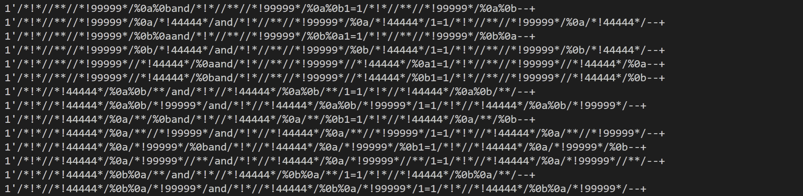
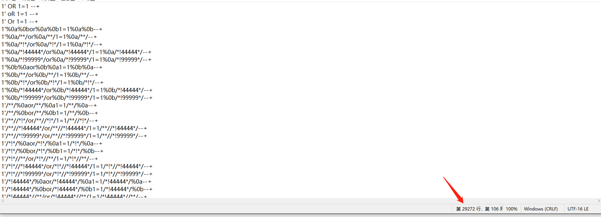

## 简介

A tools to fuzz WAFs for sql injection payloads.

自动化生成sql注入fuzz payload的小工具，主要用于绕过基于正则引擎的waf（如某狗）。

基于自定义的插件规则，获取到尽可能多的payload。 


## 核心思想

SQLKiller可以通过扩展插件，实现对基础的sql注入测试payload进行变换。

拿我们预定于的三个模块UpperCaseMain,Space2Payload,EqualBypass举例：

UpperCaseMain是对注入的关键词进行变换，如and，最终会得到以下结果：

['And', 'aNd', 'anD', 'aND', 'ANd', 'AND', 'AnD']

Space2Payload是对空格进行变换，如1' and 1=1 --+,最终会得到1950条结果。类似：



EqualBypass就是将“=”进行变换，变成like，regexp等方法。

我们将三种payload放入一个列表里：

```
funcs=[UpperCaseMain,Space2Payload,EqualBypass]
```

从len(funcs)中选一个方式进行变化，选两个方式进行变化，直到选到len(funcs)-1方式进行变化。

选择的方式，执行先后顺序也存在变化，即需要进行一种全排列，最终会获取到所有函数的变化的payload。

我们对函数可能的调用情况进行全排列：

```
for func_set in permutations(funcs,toselect):
```

之后我们可以看到所有的调用可能：

```
(<function UpperCaseMain at 0x016C7300>,)
convert(func_set[0],["1' or 1=1 --+"])
(<function Space2Payload at 0x016C7198>,)
convert(func_set[0],["1' or 1=1 --+"])
(<function EqualBypass at 0x016C7348>,)
convert(func_set[0],["1' or 1=1 --+"])
(<function UpperCaseMain at 0x016C7300>, <function Space2Payload at 0x016C7198>)
convert(func_set[1],convert(func_set[0],["1' or 1=1 --+"]))
(<function UpperCaseMain at 0x016C7300>, <function EqualBypass at 0x016C7348>)
convert(func_set[1],convert(func_set[0],["1' or 1=1 --+"]))
(<function Space2Payload at 0x016C7198>, <function UpperCaseMain at 0x016C7300>)
convert(func_set[1],convert(func_set[0],["1' or 1=1 --+"]))
(<function Space2Payload at 0x016C7198>, <function EqualBypass at 0x016C7348>)
convert(func_set[1],convert(func_set[0],["1' or 1=1 --+"]))
(<function EqualBypass at 0x016C7348>, <function UpperCaseMain at 0x016C7300>)
convert(func_set[1],convert(func_set[0],["1' or 1=1 --+"]))
(<function EqualBypass at 0x016C7348>, <function Space2Payload at 0x016C7198>)
convert(func_set[1],convert(func_set[0],["1' or 1=1 --+"]))
(<function UpperCaseMain at 0x016C7300>, <function Space2Payload at 0x016C7198>, <function EqualBypass at 0x016C7348>)
convert(func_set[2],convert(func_set[1],convert(func_set[0],["1' or 1=1 --+"])))
(<function UpperCaseMain at 0x016C7300>, <function EqualBypass at 0x016C7348>, <function Space2Payload at 0x016C7198>)
convert(func_set[2],convert(func_set[1],convert(func_set[0],["1' or 1=1 --+"])))
(<function Space2Payload at 0x016C7198>, <function UpperCaseMain at 0x016C7300>, <function EqualBypass at 0x016C7348>)
convert(func_set[2],convert(func_set[1],convert(func_set[0],["1' or 1=1 --+"])))
(<function Space2Payload at 0x016C7198>, <function EqualBypass at 0x016C7348>, <function UpperCaseMain at 0x016C7300>)
convert(func_set[2],convert(func_set[1],convert(func_set[0],["1' or 1=1 --+"])))
(<function EqualBypass at 0x016C7348>, <function UpperCaseMain at 0x016C7300>, <function Space2Payload at 0x016C7198>)
convert(func_set[2],convert(func_set[1],convert(func_set[0],["1' or 1=1 --+"])))
(<function EqualBypass at 0x016C7348>, <function Space2Payload at 0x016C7198>, <function UpperCaseMain at 0x016C7300>)
convert(func_set[2],convert(func_set[1],convert(func_set[0],["1' or 1=1 --+"])))
```

## 结果测试

我们对1' or 1=1 --+这个payload进行三种插件的变化：



共生成了29272条payload。


